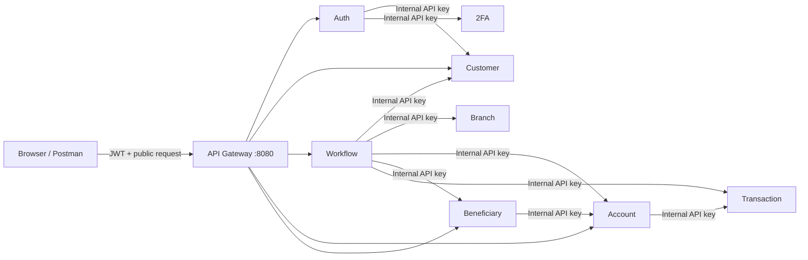
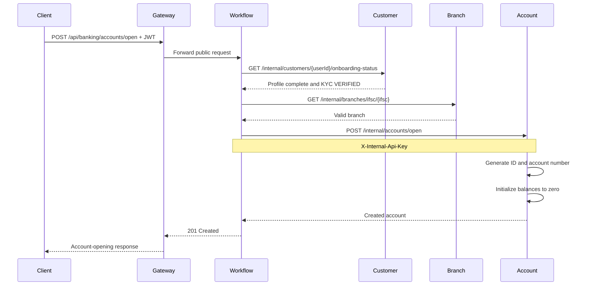
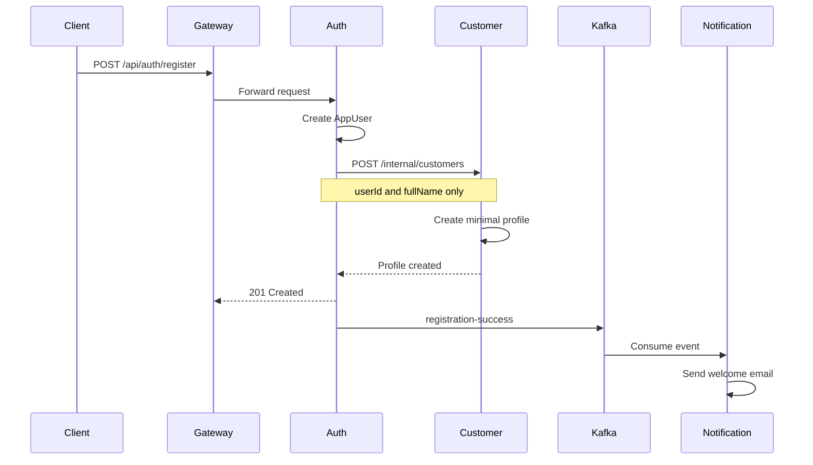
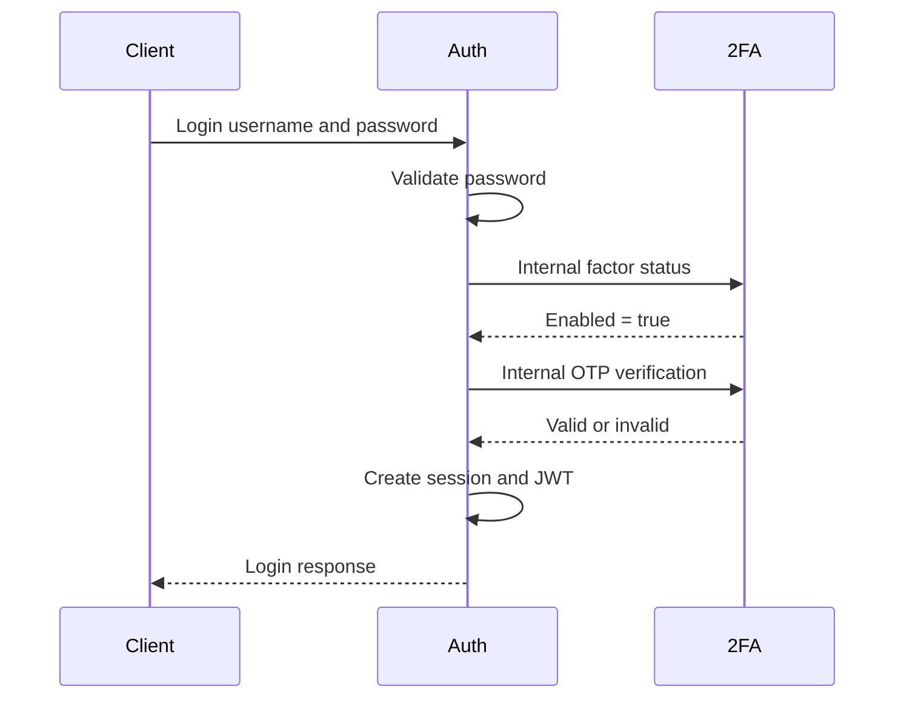
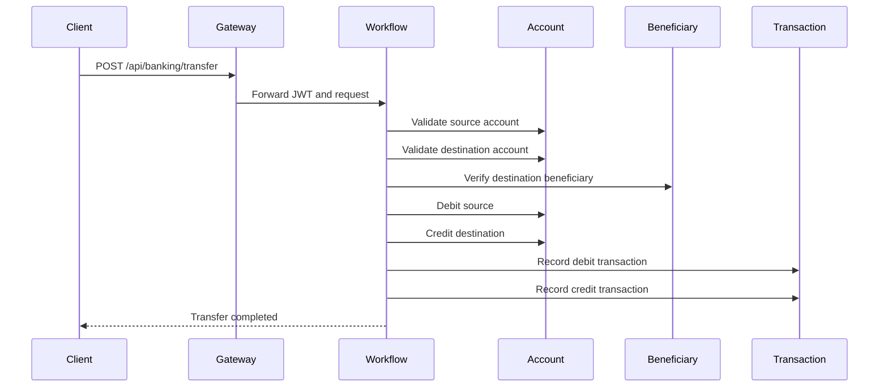

# Internal API Architecture Guide

Internal APIs are private service-to-service routes. The frontend and Postman call public `/api/**` routes through the API Gateway, while backend services call `/internal/**` routes directly over the Compose network.

## The two API layers



### Public APIs

Public APIs represent actions a user is allowed to request:

```http
POST /api/auth/register
PUT /api/customers/me
POST /api/banking/accounts/open
POST /api/banking/transfer
GET /api/accounts
```

Clients send these requests to the API Gateway:

```text
http://localhost:8080
```

Most public endpoints require:

```http
Authorization: Bearer <JWT>
```

The JWT establishes:

- Who the user is
- Their immutable `userId`
- Their role, such as `CUSTOMER` or `ADMIN`
- Whether their token is still valid

### Internal APIs

Internal APIs are implementation operations needed by another trusted service:

```http
POST /internal/customers
GET /internal/customers/{userId}/onboarding-status
POST /internal/accounts/open
POST /internal/accounts/{id}/debit
POST /internal/accounts/{id}/credit
POST /internal/transactions
```

They require:

```http
X-Internal-Api-Key: <INTERNAL_API_KEY>
```

They are called directly through Compose DNS, for example:

```text
http://customer-service:8083/internal/customers/...
http://account-service:8085/internal/accounts/...
```

They are not configured as Gateway routes. Therefore this should not work externally:

```text
http://localhost:8080/internal/accounts/open
```

## Why internal APIs exist

Consider account opening. The client should not directly request something like:

```http
POST /api/accounts

{
  "customerUserId": "...",
  "accountNumber": "...",
  "balance": 500000
}
```

That would let the client:

- Open an account without KYC
- Claim another user's `userId`
- Choose an account number
- Choose the starting balance
- Bypass branch validation

Instead, the client can only request the business operation:

```http
POST /api/banking/accounts/open
Authorization: Bearer <JWT>
Idempotency-Key: <unique-key>

{
  "accountType": "SAVINGS",
  "branchIfsc": "ORCL0000001"
}
```

Workflow then performs the trusted internal work:



The client requests the outcome. Workflow controls how that outcome is produced.

## JWT versus the internal API key

These credentials answer different questions.

### JWT: Which user made this request?

For example:

```json
{
  "sub": "a812a39e-d768-474c-87ca-b05c2b1c5ea8",
  "username": "gokul",
  "roles": ["CUSTOMER"]
}
```

The `sub` value becomes the authenticated identity.

When the client calls `POST /api/banking/deposit`, Workflow obtains the customer identity from the JWT. It does not accept a `customerUserId` from the request body. That prevents a caller from submitting another user's ID.

### Internal API key: Is a trusted service making this call?

When Workflow calls Account, it supplies:

```http
X-Internal-Api-Key: <shared-secret>
```

Account checks whether the key matches its configured `INTERNAL_API_KEY`.

Therefore:

- JWT identifies the customer.
- The internal key authenticates the calling service layer.
- The request data carries the already-established `userId`.

The internal key does not represent a customer and does not replace the JWT on public routes.

## Why internal endpoints can be more powerful

A public account endpoint is read-oriented:

```http
GET /api/accounts
GET /api/accounts/{id}
GET /api/accounts/{id}/balance
```

These routes check customer ownership or administrator role.

Internal Account endpoints can do much more:

```http
POST /internal/accounts/open
POST /internal/accounts/{id}/debit
POST /internal/accounts/{id}/credit
POST /internal/accounts/{id}/movements/{reference}/reverse
```

These operations are intentionally unavailable to clients. Otherwise a client could directly credit its balance or reverse a legitimate debit.

## Registration flow

The registration endpoint belongs to Auth:

```http
POST /api/auth/register
```

Auth owns:

- Username
- Password hash
- Email
- Phone
- Roles and sessions

Customer owns:

- Full name
- Family information
- Date of birth
- Address
- KYC

Registration therefore crosses a service boundary:



Customer does not read `APP_USER` directly. Auth sends the necessary identity through an internal API.

## 2FA login flow

Auth owns the login process, but 2FA Service owns TOTP secrets.



Auth never directly reads the `AUTH_FACTOR` table. It asks 2FA Service through its internal contract.

If 2FA is enabled:

- Missing OTP means login fails without a JWT.
- Incorrect OTP means login fails without a JWT.
- Correct OTP means Auth issues a JWT.
- The response contains `twoFactorEnabled: true`.

## Beneficiary creation flow

The public request contains:

```json
{
  "nickname": "Friend",
  "beneficiaryName": "Example User",
  "relationship": "FRIEND",
  "accountNumber": "849387145265",
  "ifscCode": "ORCL0000002",
  "favourite": true
}
```

Beneficiary Service does not own accounts, so it must not query the `ACCOUNTS` table. Instead:

```text
Client
  -> Gateway
  -> Beneficiary Service
  -> Account internal validation API
  -> Beneficiary Service stores the validated beneficiary
```

Account returns information such as:

```json
{
  "accountId": "...",
  "customerUserId": "...",
  "accountNumber": "849387145265",
  "branchIfsc": "ORCL0000002",
  "status": "ACTIVE",
  "active": true
}
```

Beneficiary Service then verifies:

- The account exists
- The account is active
- The supplied IFSC matches the actual account IFSC
- `SELF` beneficiaries belong to the authenticated customer

It stores the beneficiary as `PENDING`; an administrator later marks it `VERIFIED`.

## Transfer orchestration

This is where internal APIs are most important.



The key architectural direction is:

```text
Workflow -> Account
Workflow -> Beneficiary
Workflow -> Transaction
```

It is not:

```text
Workflow -> Account -> Beneficiary -> Transaction
```

Account performs only account operations and returns control to Workflow. Workflow decides which service is called next. This keeps orchestration visible in one place and enables compensation.

## Rollback and compensation

A microservice saga cannot use a normal database rollback across multiple services because each service performs and commits its own database transaction.

Suppose this happens:

```text
1. Source debit succeeds
2. Destination credit succeeds
3. Transaction recording fails
```

Account's database transactions have already committed. Workflow therefore performs compensating operations:

```text
Reverse recorded transactions, if any
Reverse destination credit
Reverse source debit
```

Each account movement has a reference such as:

```text
TRF-<uuid>:SOURCE:DEBIT
TRF-<uuid>:DESTINATION:CREDIT
```

Workflow stores these references in `BANKING_WORKFLOWS`. Account stores applied operations in `ACCOUNT_MOVEMENTS`.

The compensation request therefore says, effectively:

```http
POST /internal/accounts/{accountId}/movements/{reference}/reverse
```

Account uses the reference to locate and reverse the exact movement.

If compensation itself fails, Workflow stores:

```text
COMPENSATION_PENDING
```

A scheduled recovery process retries it later.

## Idempotency and internal APIs

Every money workflow and account-opening request requires:

```http
Idempotency-Key: unique-client-key
```

Workflow stores the key together with:

- User ID
- Workflow type
- Account IDs
- Destination account number
- Amount
- Description
- Account type and IFSC for account opening
- Workflow result references

If the same request is repeated with the same key:

```text
Same key + same payload -> original result
```

No additional debit, credit, account, or transaction is created.

If the key is reused with changed input:

```text
Same key + different amount or destination -> 409 Conflict
```

Account's internal mutation routes also use reference numbers. This gives protection at two levels:

- Workflow prevents the business operation from running twice.
- Account prevents the same movement reference from being applied twice.

## Mini-statement internal call

Mini-statement is not a complex multi-service mutation, so it does not need Workflow.

```text
Client -> Gateway -> Account -> Transaction
```

Account first checks:

- The account exists
- The caller owns it or is an administrator

Account then calls Transaction's read-only internal recent-transactions route.

This direct service call is appropriate because:

- It is read-only.
- There is no distributed mutation.
- No rollback is required.
- Account is composing information for an account-specific response.

Using Workflow for every cross-service request would turn it into a bottleneck and a god service.

## Internal APIs and database ownership

All services currently use the same Oracle schema locally, but that does not mean they share ownership.

- Auth owns `APP_USER`.
- Customer owns `CUSTOMER_PROFILE` and `CUSTOMER_KYC`.
- Account owns `ACCOUNTS` and `ACCOUNT_MOVEMENTS`.
- Beneficiary owns `BENEFICIARIES`.
- Transaction owns `BANK_TRANSACTIONS`.
- Workflow owns `BANKING_WORKFLOWS`.

Customer Service must not inject an `AppUserRepository`. It communicates with Auth when it needs Auth-owned information.

This is important because the services can later be moved to separate databases without rewriting the business workflows.

## Why some database foreign keys are absent

A foreign key is appropriate when both tables belong to the same service:

```text
APP_USER.ROLE_ID -> ROLES.ROLE_ID
ACCOUNT_MOVEMENTS.ACCOUNT_ID -> ACCOUNTS.ACCOUNT_ID
EMAIL_DELIVERY_LOG.NOTIFICATION_ID -> EMAIL_NOTIFICATION.NOTIFICATION_ID
```

This is intentionally not a database foreign key:

```text
ACCOUNTS.CUSTOMER_USER_ID -> APP_USER.USER_ID
```

Account and Auth are separate service boundaries. In a real microservice deployment they may use different databases, where a database foreign key cannot exist.

The relationship is validated through:

- JWT identity
- Internal API contracts
- Workflow prerequisites
- Service-level ownership checks

## Security limitation of the current shared key

The current `INTERNAL_API_KEY` is a useful development-stage control, but it authenticates all trusted services using one shared secret.

If one service leaks the key, it could potentially call another service's internal APIs.

A production evolution would include:

1. Separate credentials for each calling service.
2. Mutual TLS between services.
3. OAuth2 client-credentials tokens with service identities.
4. Network policies restricting which services can reach each port.
5. Key rotation and secret-manager storage.
6. Audit fields such as calling service, correlation ID, and request ID.

The architecture already separates public and internal contracts. The authentication mechanism can therefore be strengthened later without redesigning every API.

## Decision guide

Use a public API when:

- A user or client is allowed to request the action.
- JWT identity and role must be checked.
- The route belongs behind the Gateway.

Use an internal API when:

- One trusted service needs another service's owned capability.
- The operation must not be directly available to clients.
- The call travels over the internal Compose network.
- The shared internal credential is required.

Use Workflow when:

- A business operation mutates multiple services.
- Steps must be ordered.
- Idempotency is required.
- A later failure requires compensation.

Use a direct internal service call when:

- It is a simple validation or read.
- It has one clear downstream owner.
- No multi-step rollback is needed.
