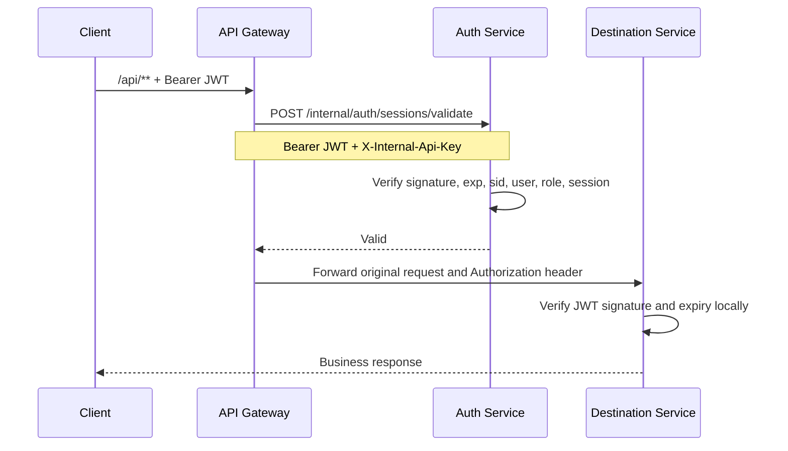

# Session Management

This document defines how login sessions, JWTs, revocation, expiry, and logout work across Auth Service and API Gateway.

## Design verdict

JWT signature and expiry validation alone cannot provide immediate logout: a correctly signed token remains cryptographically valid until its `exp`. The platform therefore uses a stateful session record in addition to the JWT. This preserves JWT identity for downstream services while allowing Auth to revoke access immediately.

The JWT claim is named `sid` (session ID), not `jti`. One login creates one `sid`, so simultaneous logins from separate devices remain independently controllable.

## Login lifecycle

```mermaid
sequenceDiagram
    participant C as Client
    participant G as API Gateway
    participant A as Auth Service
    participant D as USER_SESSION

    C->>G: POST /api/auth/login
    G->>A: Public route; no session validation
    A->>A: Validate password and optional TOTP
    A->>A: Generate UUID sid and signed JWT
    A->>D: Insert ACTIVE session with same sid and expiry
    A-->>G: JWT containing sub, roles, sid, iat, exp
    G-->>C: Login response
```

Auth creates the JWT and session in the same login operation. The JWT subject (`sub`) is the immutable `userId`; `sid` identifies the `USER_SESSION` row. The row and token receive the same expiry instant.

## Protected-request lifecycle



Gateway applies validation to every protected `/api/**` route. Only registration, login, and CORS preflight requests bypass it. Auth requires all of the following:

- a valid bearer format and JWT signature;
- an unexpired JWT;
- nonblank `sub` and `sid` claims;
- a matching `USER_SESSION` owned by that `sub`;
- session status `ACTIVE` and a future session expiry;
- an active Auth user;
- token roles that still match the user's current role.

The destination service still verifies JWT signature and expiry. Gateway owns online revocation enforcement; destination services retain defence-in-depth and identity parsing.

## Logout behavior

`POST /api/auth/logout` invalidates only the session named by the current JWT's `sid`. Other devices remain logged in.

`POST /api/auth/logout-all` invalidates every active session belonging to the authenticated user, including the token used for the request. The logout response can finish, but all subsequent requests using any of those tokens receive `401 Unauthorized`.

Invalidation records `INVALIDATED` plus `INVALIDATED_AT`; it does not delete audit data. There can be a small in-flight-request race: a request already admitted by Gateway may complete while logout is occurring, but later requests are rejected.

## Expiry behavior

The lifetime is configured only with the required `JWT_EXPIRATION_MINUTES` value in `.env`; local development currently uses 30 minutes. Auth calculates one expiry instant from that value and assigns it to both the JWT and the matching `USER_SESSION` row. Changing that single line to `45` makes all newly issued tokens and sessions last 45 minutes. Existing sessions keep the expiry assigned when they were created. It is an absolute lifetime from login, not an inactivity timeout and not a sliding session. API activity does not extend it.

JWT parsing rejects the token as soon as `exp` passes. A scheduled Auth cleanup also changes due `ACTIVE` database rows to `EXPIRED`; its interval is controlled by `SESSION_CLEANUP_DELAY_MS` and defaults to 60 seconds. Cleanup is housekeeping, not the security boundary: validation checks the timestamp even before the scheduler updates the status.

There is currently no refresh-token flow. After expiry, the user must log in again.

## Failure and status contract

| Situation | Gateway result |
| --- | --- |
| Missing or malformed bearer token | `401 Unauthorized` |
| Invalid signature or expired JWT | `401 Unauthorized` |
| Missing/unknown `sid` | `401 Unauthorized` |
| Logged-out, expired, or mismatched session | `401 Unauthorized` |
| User deactivated or role changed | `401 Unauthorized` |
| Auth validation unavailable or timed out | `503 Service Unavailable` |
| Valid active session | Request is routed normally |

Gateway deliberately fails closed. If Auth is unavailable, it cannot prove the session is still active and must not route the request. The timeout is configured with `GATEWAY_SESSION_VALIDATION_TIMEOUT_MS`, defaulting to 3000 ms.

Clients must clear their locally stored JWT and return to the login screen on `401`. A `503` is temporary dependency failure and should not silently erase the token; the client may show a retry message.

## Security boundaries

The validation endpoint is internal-only:

```http
POST /internal/auth/sessions/validate
Authorization: Bearer <JWT>
X-Internal-Api-Key: <INTERNAL_API_KEY>
```

It is called by Gateway over the service network and is not published as a Gateway route. The API key proves the trusted service caller; the JWT identifies the user and session. Production hardening should replace the single shared internal key with per-service credentials, mTLS, or OAuth2 client credentials.

## Adding future session features

The current boundary keeps future extensions localized:

- add a user-facing session list and per-device revocation in Auth;
- store device label, IP summary, and last-seen time without changing JWT identity;
- introduce refresh-token rotation as a separate credential flow;
- add a short Gateway cache only if bounded revocation delay is acceptable;
- publish session-security audit events after invalidation or suspicious validation failures.

Do not make downstream services query `USER_SESSION`. Auth owns session state, and Gateway is the single external enforcement point.
